# report

[TOC]

# Overview

## 1. Directory Structure

The whole directory structure of this project is showm below : 

~~~~
├── README.md
├── a.out				// the runnable output
├── activities			// Define various events basic logical processing entity
│   ├── Activity.cpp
│   ├── CombatActivty.cpp
│   ├── ConflictActivity.cpp
│   ├── DiplomacyActivity.cpp
│   ├── MiningActivity.cpp
│   ├── UpgradSystemActivity.cpp
│   ├── EmptyActivity.cpp
│   ├── SystemsRecoveryActivity.cpp
│   ├── TradingActivity.cpp
│   ├── TravelEfficiencyActivity.cpp
│   └── subactivities
│       ├── CombatDefensiveActivity.cpp
│       ├── CombatManeuversActivity.cpp
│       ├── CombatOffensiveActivity.cpp
│       ├── ConflictEvasionActivity.cpp
│       └── ConflictProceedActivty.cpp
├── beginer				
│   └── Bootstrap.cpp        // do all the init work, and start the whole system 
├── conf				     // def all the paramter this system will be used 
│   ├── Abilities.cpp	     // the type of Abilities for different spaceship
│   ├── ExchangeRate.cpp     // the exchange rate for money to tradable good...
│   ├── RumtimeParameter.cpp // the Runtime parameter
│   └── SpaceshipType.cpp    // the init Spaceship paramter 
├── dao
│   └── SpaceShipDAO.cpp	 // the class to do our spaceship's data opreration 
├── dispatcher
│   └── SelectorDispatcher.cpp // this calss is the first dispatcher to select services
├── entity					 // whole pojo entity
│   ├── CrewMember.cpp		
│   ├── Officer.cpp
│   ├── Resource.cpp
│   └── SpaceShip.cpp
├── factory
│   └── SpaceshipFactory.cpp // the factory to produce the spaceship 
├── main.cpp				
├── service					// the second dispatcher to select event 
│   ├── PlanetService.cpp
│   ├── Service.cpp
│   ├── SpaceshipService.cpp
│   ├── EmptyService.cpp
│   ├── ArmoryService.cpp
│   └── TradingStationService.cpp
└── util					// the Goable util for this system
    ├── GameLogger.cpp
    ├── GameManager.cpp
    └── GameTimer.cpp
~~~~

## 2. UML

The Whole UML of this project related is shown below. 


The UML diagram for the first time looking at the entire project is complicated. Next I will explain the UML by modules.

**Entity Module : **

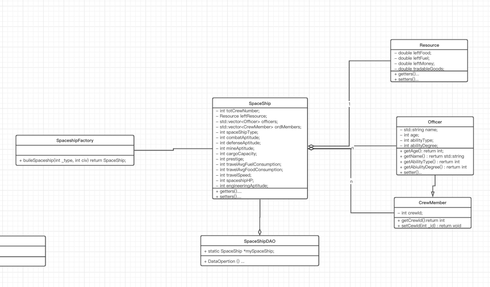

This module is for define the spaceship entity. 

**Spaceship** shoude include those class : 

* Resource : the class defines the essential raw meterial 
* officer : give spaceship different abilities
* crewmember : nomal crew in this spaceship

exclude those class, spaceship also define some spacecraft parameters, such as : _spaceshipType, and so on

**SpaceshipFactory ** is a class for produce the **instance of spaceship** which have lots of init parameter

**SpaceshipDAO** is a class for doing data operation for our spaceship during the time of game running

**Service Module :**

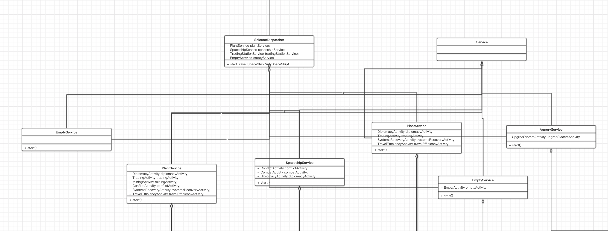

Service Moduel simulated various selectors where the spacecraft might land. such as the 

* PlantService : simulated the event when landing in a plant
* TradingStationService :  simulated the event when landing in a trading station
* EmptyStationService : simulated the event when landing in a empty selector
* ArmoryService : simulated the event when landing in a amory selector
* SpaceshipService : simulated the event when encountering the spaceship 

the **ServiceDispatcher** is a class to do the first level dispatch work,  just randomly dipatch our spaceship to all of the services, which's code is shown below : 

~~~c++
//
//  SelectorDispatcher.cpp
//  apAss2_spaceship
//
//  Created by 方舟Ark on 2019/11/19.
//  Copyright © 2019年 ark. All rights reserved.
//
#ifndef _SelectorDispatcher
#define _SelectorDispatcher

#include "../service/PlanetService.cpp"
#include "../service/SpaceshipService.cpp"
#include "../service/TradingStationService.cpp"
#include "../service/EmptyService.cpp"
#include "../service/ArmoryService.cpp"
/**
 
 The dispather for the spaceship to encounter selector
 
 */
class SelectorDispatcher{

    
    private :
    
    // for the logic when encounter plant
    PlantService plantService;
    
    // for the logic when encounter other spaceship
    SpaceshipService spaceshipService;
    
    // for the logic when encounter TradingStation
    TradingStationService tradingStationService;
    
    // for the logic when encounter the empty selector
    EmptyService emptyService;
    
    // for the logic when encounter the armory station
    ArmoryService armoryService;
    
    public :
    
    
    // ------------------------- main dispatcher --------------------------------
    
    // our goal is Star and Sea !!!!!!!!!
    void startTravel(SpaceShip &mySpaceShip){
        // check the spaceship's fuel and food
         if(gameFail(mySpaceShip)) {GameManager::gameFail("you lose, game over!");}
        
        GameLogger::stdOut("--------------------------------------------------------------");
        
        // randomly choose next selector
        int randomSeed = (GameTimer::_rand() % 100) + 1;

        if(randomSeed <= 35){
            // Spaceship encounter.
            spaceshipService.start(mySpaceShip);
            
        }else if(randomSeed > 35 && randomSeed <= 60){
            // Planet encounter.
            plantService.start(mySpaceShip);
            
        }else if(randomSeed > 60 && randomSeed <= 75){
            // Trading station.
            tradingStationService.start(mySpaceShip);
            
        }else if(randomSeed > 75 && randomSeed <= 90){
            // Empty sector. This is pretty boring.
            emptyService.start(mySpaceShip);
            
        }else{
            // Some other space thing. This is up to you.
            armoryService.start(mySpaceShip);
        }
        
    }
    // ------------------------- main dispatcher --------------------------------

    
    
    
    
    
    // ------------------------- helper function --------------------------------
    bool gameFail(SpaceShip mySpaceShip){
        
        // resource
        // return condition1 || condition2 || ....
        return lackResource(mySpaceShip);
    }
    
    
    
    // judge if lack of resource
    bool lackResource(SpaceShip mySpaceShip){
        
        
        if(mySpaceShip.getResource().getLeftFood() <= 0){
            
            return true;
            
        }
            
        if( mySpaceShip.getResource().getLeftFuel() <= 0){
            
            return true;
            
        }
        return false;
        
    }
    

    
};

#endif

~~~

each service dipatch our spaceship to each activity which is the second dispatch work. take plant service for example : 

~~~c++
//
//  PlanetService.cpp
//  apAss2_spaceship
//
//  Created by 方舟Ark on 2019/11/19.
//  Copyright © 2019年 ark. All rights reserved.
//

#ifndef _PlantService
#define _PlantService

#include "Service.cpp"

/*
    the servie for spaceship encounter the plant
    * Trade, Conflict, Mining, Diplomacy
 
 */
class PlantService : public Service{
    
    private :
    
    /* Diplomacy */
    DiplomacyActivity diplomacyActivity;
    
    /* Trading */
    TradingActivity tradingActivity;
    
    /* Mining */
    MiningActivity miningActivity;
    
    /* conflict */
    ConflictActivity conflictActivity;
    
    /* System Recovery */
    SystemsRecoveryActivity systemsRecoveryActivity;
    
    /* Travel eff*/
    TravelEfficiencyActivity travelEfficiencyActivity;
    
    
    public :
    
    void start(SpaceShip &spaceShip){
        
        GameLogger::stdOut("You are now leading in a plant in round : " + std::to_string(RuntimeParameter::GAME_CURRENT_ROUND));
        
        switch (GameTimer::_rand() % 6) {
            case 0:
                /* DiplomacyActivity */
                GameLogger::stdOut("You are doing Diplomacy in this plant");
                diplomacyActivity.start(spaceShip);
                break;
            case 1:
                /* tradingActivity */
                GameLogger::stdOut("You are doing trading in this plant");
                tradingActivity.start(spaceShip);
                break;
            case 2:
                GameLogger::stdOut("You are doing mining in this plant");
                miningActivity.start(spaceShip);
                break;
            case 3:
                GameLogger::stdOut("You are encountering conflict in this plant");
                conflictActivity.start(spaceShip);
                break;
            case 4:
                GameLogger::stdOut("You are doing System recovery in this plant");
                systemsRecoveryActivity.start(spaceShip);
                break;
            case 5:
                GameLogger::stdOut("You are doing Travel efficiency in this plant");
                travelEfficiencyActivity.start(spaceShip);
                break;
            default:
                GameManager::gameError("Plant Service Activity Type Error !");
                break;
        }
        
    }

};

#endif

~~~

**Activity Module : **

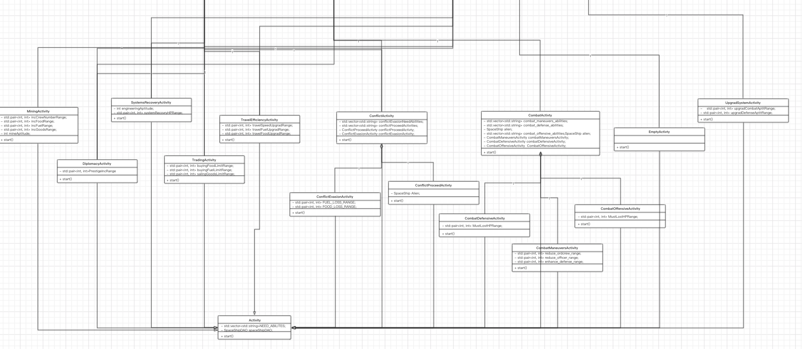

All event classes simulate the required events, which specify the processing logic of the event, which is the smallest logical processing unit. Finally, there is a need in the event class to use **SpaceshipDAO** to do data interaction with our **spaceship entity** for defining the outcome of this event.

## 3. compile command

This project is compile wth c++ standard 11.	so please compile an run the whole project like following : 

~~~shell
# compile 
g++ -std=c++11 main.cpp

# run
./a.out
~~~

# Characteristics Set

All the Initialization parameters is defined in a static class : **SpaceshipType.cpp**, The explanation can be found in the comment : 

~~~c++
//
//  SpaceshipType.cpp
//  apAss2_spaceship
//
//  Created by 方舟Ark on 2019/11/21.
//  Copyright © 2019年 ark. All rights reserved.
//

/*
 
 this class for def all the conf for a spaceship during a **init time**
 
 */

#ifndef _SpaceshipType
#define _SpaceshipType

#include "../util/GameManager.cpp"
#include "../util/GameTimer.cpp"
#include "Abilities.cpp"
#include <vector>
#include <string>

class SpaceshipType{
    
    
    public :
    
    //  -------------------------------------- helper filed --------------------------------
   /* def the cap of this spaceship*/
    static int FIRST_DEGREE_SPACESHIP;
    static int SECOND_DEGREE_SPACESHIP;
    static int THIRD_DEGREE_SPACESHIP;
    static int FORTH_DEGREE_SPACESHIP;
    static int FIFTH_DEGREE_SPACESHIP;
    
    /* def which civilization the space ship belongs */
    // our civilization
    static int EARTH_SPACESHIP;
    // other civilization
    static int MARS_SPACESHIP;
    static int MERCURY_SPACESHIP;
    
    // officer random names & age
    static std::vector<std::string> officerNames;
    static std::vector<int> officerAges;
    // randge for officerAbility [first, second]
    static std::pair<int, int> officerAbilityDegreeRange;

    
    /*
     int combatAptitude;
     int defenseAptitude
     int mineAptitude;
     int travelSpeed;
     int cargoCapacity;
     int prestige;
     
     int travelAvgFuelConsumption;
     int travelAvgFoodConsumption;
     
     int engineeringAptitude;
     */
    static std::pair<int, int> combatAptitudeRange;
    static std::pair<int, int> defenseAptitudeRange;
    static std::pair<int, int> mineAptitudeRange;
    static std::pair<int, int> travelSpeedRange;
    static std::pair<int, int> cargoCapacityRange;
    static std::pair<int, int> prestigeRange;
    static std::pair<int, int> travelAvgFuelConsumptionRange;
    static std::pair<int, int> travelAvgFoodConsumptionRange;
    static std::pair<int, int> engineeringAptitudeRange;
    
    /* the HP base of spaceship, different type of spaceship have diff HP */
    static int spaceshipHPBase;
    
    
    
    
    
    //  -------------------------------------- helper function --------------------------------
    
    /* init evevthing */
    static void _init();
    
    /* get the addition bonus by tppe of spaceship */
    static int getBonusByType(int _spaceshipType){return _spaceshipType;}
    
    /* get the name of a spaceship */
    static std::string getSpaceshipNameByType(int _spaceshipType);
    
    /* get the abilites */
    static std::vector<std::string> getInitAbility(int _spaceshipCiv);
    
    /* get a random name for the officers name array*/
    static std::string getRandomOfficerName();
    
    /* get a random type of spaceship*/
    static int getRandomSpaceshipType();
    
    /* get a random spaceship civ include earth */
    static int getRandomSpaceshipCiv();
    
    /* get a random alien spaceship civ (exclude earth)*/
    static int getRandomAlienSpaceshipCiv();
    
    /* get a random age for the officer age array*/
    static int getRandomOfficerAge();
    
    /* get a random ability degree */
    static int getRandomAbilityDegree();
    
    /* get a random combatAptitude */
    static int getRandomCombatAptitudeBySpaceshipType(int _spaceshipType);
    
    /* get a random defenseAptitude */
    static int getRandomDefenseAptitudeBySpaceshipType(int _spaceshipType);
    
    /* get a random mineAptitude */
    static int getRandomMineAptitudeBySpaceshipType(int _spaceshipType);
    
    /* get a random travelSpeed */
    static int getRandomTravelSpeedBySpaceshipType(int _spaceshipType);
    
    /* get a random cargoCapacity */
    static int getRandomCargoCapacityBySpaceshipType(int _spaceshipType);
    
    /* get a random prestige */
    static int getRandomPrestigeBySpaceshipType(int _spaceshipType);
    
    /* get a random travelAvgFuelConsumption*/
    static int getRandomTravelAvgFuelConsumption(int _spaceshipType);
    
    /* get a random travelAvgFoodConsumption */
    static int getRandomTravelAvgFoodConsumption(int _spaceshipType);
    
    /* get a HP of the spaceship by it's type */
    static int getSpaceshipHpBySpaceshipType(int _spaceshipType);
    
    /* get a random engineering Aptitude*/
    static int getRandomEngineeringAptitude(int _spaceshipType);
    
    
};

// different capacity
int SpaceshipType::FIRST_DEGREE_SPACESHIP = 1;
int SpaceshipType::SECOND_DEGREE_SPACESHIP= 2;
int SpaceshipType::THIRD_DEGREE_SPACESHIP = 3;
int SpaceshipType::FORTH_DEGREE_SPACESHIP = 4;
int SpaceshipType::FIFTH_DEGREE_SPACESHIP = 5;

// different civilization
int SpaceshipType::EARTH_SPACESHIP = 1;
int SpaceshipType::MARS_SPACESHIP = 2;
int SpaceshipType::MERCURY_SPACESHIP = 3;

/* Using g++11 compile */
// different the names of officer
std::vector<std::string> SpaceshipType::officerNames = {"Fz", "Ark", "Bill", "Joy", "Iras", "Bob", "FangZhou", "Joly"};
std::vector<int> SpaceshipType::officerAges = {20, 22, 23, 34, 45, 12, 34, 12, 43, 55, 33, 23};
/* [firstInt, secondInt]*/
std::pair<int, int> SpaceshipType::officerAbilityDegreeRange(20, 50);

/*
 int combatAptitude;
 int mineAptitude;
 int travelSpeed;
 int cargoCapacity;
 int prestige;
 */
std::pair<int, int> SpaceshipType::combatAptitudeRange(30, 60);
std::pair<int, int> SpaceshipType::mineAptitudeRange(2, 10);
std::pair<int, int> SpaceshipType::travelSpeedRange(70, 80);
std::pair<int, int> SpaceshipType::cargoCapacityRange(90, 100);
std::pair<int, int> SpaceshipType::prestigeRange(40, 60);
std::pair<int, int> SpaceshipType::travelAvgFuelConsumptionRange(10, 20);
std::pair<int, int> SpaceshipType::travelAvgFoodConsumptionRange(20, 30);
std::pair<int, int> SpaceshipType::engineeringAptitudeRange(10, 20);
std::pair<int, int> SpaceshipType::defenseAptitudeRange(10, 20);

int SpaceshipType::spaceshipHPBase = 100;

/* pass the integer of a spaceship type, return it's name */
std::string SpaceshipType::getSpaceshipNameByType(int _spaceshipType){
    
    switch (_spaceshipType) {
        case 1:
            return "First Degree Spaceship";
        case 2:
            return "Second Degree Spaceship";
        case 3:
            return "Third Degree Spaceship";
        case 4:
            return "Forth Degree Spaceship";
        case 5:
            return "Fifth Degree Spaceship";
        default:
            GameManager::gameError("spaceship type error");
    }
    
    return "";
    
}

/* get the ability vector by _spaceshipCiv, for example : our shpaceshi is EARTH, and get all of the ability */
std::vector<std::string> SpaceshipType::getInitAbility(int _spaceshipCiv){
    
    std::vector<std::string> abilities;
    
    if(_spaceshipCiv == EARTH_SPACESHIP){
        
        // our spaceship earth
        abilities.push_back(Abilities::ABILITY_CAPTAIN);
        abilities.push_back(Abilities::ABILITY_PILOT);
        abilities.push_back(Abilities::ABILITY_MINING);
        abilities.push_back(Abilities::ABILITY_WEAPONS);
        abilities.push_back(Abilities::ABILITY_ENGINEERING);
        
    }else if(_spaceshipCiv == MARS_SPACESHIP){
        // mars
        
        abilities.push_back(Abilities::ABILITY_CAPTAIN);
        
    }else if(_spaceshipCiv == MERCURY_SPACESHIP){
        // MERCURY
        
        abilities.push_back(Abilities::ABILITY_CAPTAIN);
        
    }else{
        
        GameManager::gameError("spaceship civ error");
    }
    
    return abilities;
}

/* get a random name for the officers name array*/
std::string SpaceshipType::getRandomOfficerName(){
    
    long length = officerNames.size();
    int randomSeed = GameTimer::_rand() % length;
    
    return officerNames[randomSeed];
}

/* get a random spaceship type */
int SpaceshipType::getRandomSpaceshipType(){
    
    return (GameTimer::_rand() % 5) + 1;
    
}

/* get a random spaceship civ */
int SpaceshipType::getRandomSpaceshipCiv(){
    
    return (GameTimer::_rand() % 3) + 1;
    
}
/* get a random alien civ */
int SpaceshipType::getRandomAlienSpaceshipCiv(){
    
    /* alien civ is 2, 3*/
    return (GameTimer::_rand() % 2) + 2;
}

/* get a random age for the officer age array*/
int SpaceshipType::getRandomOfficerAge(){
    long length = officerAges.size();
    int randomSeed = GameTimer::_rand() % length;
    
    return officerAges[randomSeed];
}

/* get a random ability degree */
int SpaceshipType::getRandomAbilityDegree(){
    
    int randomSeed = GameTimer::_rand() % (officerAbilityDegreeRange.second - officerAbilityDegreeRange.first);
    
    return officerAbilityDegreeRange.first + randomSeed;
}

/* get a random defenseAptitude */
int SpaceshipType::getRandomDefenseAptitudeBySpaceshipType(int _spaceshipType){
    
    return _spaceshipType * GameTimer::getRandomByRange(defenseAptitudeRange);
    
}

/* get a random combatAptitude by the type of spaceship*/
int SpaceshipType::getRandomCombatAptitudeBySpaceshipType(int _spaceshipType){
    
    int randomSeed = GameTimer::_rand() % (combatAptitudeRange.second - combatAptitudeRange.first);
    randomSeed *= getBonusByType(_spaceshipType);
    
    return combatAptitudeRange.first * getBonusByType(_spaceshipType) + randomSeed;
}

/* get a random mineAptitude */
int SpaceshipType::getRandomMineAptitudeBySpaceshipType(int _spaceshipType){
    int randomSeed = GameTimer::_rand() % (mineAptitudeRange.second - mineAptitudeRange.first);
    randomSeed *= getBonusByType(_spaceshipType);
    
    return mineAptitudeRange.first * getBonusByType(_spaceshipType) + randomSeed;
}

/* get a random travelSpeed */
int SpaceshipType::getRandomTravelSpeedBySpaceshipType(int _spaceshipType){
    
    int randomSeed = GameTimer::_rand() % (travelSpeedRange.second - travelSpeedRange.first);
    randomSeed *= getBonusByType(_spaceshipType);
    
    return travelSpeedRange.first * getBonusByType(_spaceshipType) + randomSeed;
    
}

/* get a random cargoCapacity */
int SpaceshipType::getRandomCargoCapacityBySpaceshipType(int _spaceshipType){
    int randomSeed = GameTimer::_rand() % (cargoCapacityRange.second - cargoCapacityRange.first);
    randomSeed *= getBonusByType(_spaceshipType);
    
    return cargoCapacityRange.first * getBonusByType(_spaceshipType) + randomSeed;
}

/* get a random prestige */
int SpaceshipType::getRandomPrestigeBySpaceshipType(int _spaceshipType){
    
    int randomSeed = GameTimer::_rand() % (prestigeRange.second - prestigeRange.first);
    randomSeed *= getBonusByType(_spaceshipType);
    
    return prestigeRange.first * getBonusByType(_spaceshipType) + randomSeed;
}

/* get a random travelAvgFuelConsumption*/
int SpaceshipType::getRandomTravelAvgFuelConsumption(int _spaceshipType){
    
    return _spaceshipType * GameTimer::getRandomByRange(travelAvgFuelConsumptionRange);
    
}

/* get a random travelAvgFoodConsumption */
int SpaceshipType::getRandomTravelAvgFoodConsumption(int _spaceshipType){
    
    return _spaceshipType * GameTimer::getRandomByRange(travelAvgFoodConsumptionRange);
    
    
}

/* a init HP of a spaceship by it's type */
int SpaceshipType::getSpaceshipHpBySpaceshipType(int _spaceshipType){
    
    return _spaceshipType * spaceshipHPBase;
    
}

/* Engineering Aptitude*/
int SpaceshipType::getRandomEngineeringAptitude(int _spaceshipType){
    
    return _spaceshipType * GameTimer::getRandomByRange(engineeringAptitudeRange);
}
#endif
~~~

I use the `pair<int, int>` to define the range , for example : 

~~~c++
/*
 int combatAptitude;
 int mineAptitude;
 int travelSpeed;
 int cargoCapacity;
 int prestige;
 */
std::pair<int, int> SpaceshipType::combatAptitudeRange(30, 60);
std::pair<int, int> SpaceshipType::mineAptitudeRange(2, 10);
std::pair<int, int> SpaceshipType::travelSpeedRange(70, 80);
std::pair<int, int> SpaceshipType::cargoCapacityRange(90, 100);
std::pair<int, int> SpaceshipType::prestigeRange(40, 60);
std::pair<int, int> SpaceshipType::travelAvgFuelConsumptionRange(10, 20);
std::pair<int, int> SpaceshipType::travelAvgFoodConsumptionRange(20, 30);
std::pair<int, int> SpaceshipType::engineeringAptitudeRange(10, 20);
std::pair<int, int> SpaceshipType::defenseAptitudeRange(10, 20);
~~~

The first parameter and the second parameter are the upper and lower bounds of our random range, respectively. 

In the initialization factory : **SpaceshipFactory**, we use these ranges to assign a random value to our ship.

It is worth noting that we do not directly use this range to generate random numbers, but instead generate the initial parameters based on some parameters such as the initial level of the spacecraft, for example : 

~~~c++
/* get a random combatAptitude by the type of spaceship*/
int SpaceshipType::getRandomCombatAptitudeBySpaceshipType(int _spaceshipType){
    int randomSeed = GameTimer::_rand() % (combatAptitudeRange.second - combatAptitudeRange.first);
    randomSeed *= getBonusByType(_spaceshipType);
    return combatAptitudeRange.first * getBonusByType(_spaceshipType) + randomSeed;
}
~~~

So, we can generate all parameters of the int numeric type in this way.

As for the **class parameter** such as the **officers**, we gemerate as the following way : 

~~~c++
/* defined the name library */
std::vector<std::string> SpaceshipType::officerNames = {"Fz", "Ark", "Bill", "Joy", "Iras", "Bob", "FangZhou", "Joly"};
/* define the age library */
std::vector<int> SpaceshipType::officerAges = {20, 22, 23, 34, 45, 12, 34, 12, 43, 55, 33, 23};

/* random generator */
for(int i=0; i<init_officer_number; i++){

    Officer tmpOfficer;
    // set name, age
    // set abilityType
    // set abilityDegree
    tmpOfficer.setCrewId(i);
    tmpOfficer.setName(SpaceshipType::getRandomOfficerName());
    tmpOfficer.setAge(SpaceshipType::getRandomOfficerAge());
    tmpOfficer.setAbilityType(Abilities::abilityToInteger(Init_Ability[i%init_Ability_length]));
    tmpOfficer.setAbilityDegree(SpaceshipType::getRandomAbilityDegree());

    // insert into spaceship
    spaceShip.addOfficer(tmpOfficer);
}
~~~

When we generate, we go directly to the defined name database, and the age library is randomly selected to generate.

# Alien Civilisations

the Alien Civilisations are defined in the static class **SpaceshipType.cpp**

~~~c++
/* def which civilization the space ship belongs */
// our civilization
static int EARTH_SPACESHIP;
// other civilization
static int MARS_SPACESHIP;
static int MERCURY_SPACESHIP;
static int ORC_SPACESHIP;
static int NIGHTELF_SPACESHIP;
~~~

there are five civilisations in this game . different civilisations have different abilities; which can be initialized   below : 

~~~c++
/* get the ability vector by _spaceshipCiv, for example : our shpaceshi is EARTH, and get all of the ability */
std::vector<std::string> SpaceshipType::getInitAbility(int _spaceshipCiv){
    
    std::vector<std::string> abilities;
    if(_spaceshipCiv == EARTH_SPACESHIP){
        // our spaceship earth
        abilities.push_back(Abilities::ABILITY_CAPTAIN);
        abilities.push_back(Abilities::ABILITY_PILOT);
        abilities.push_back(Abilities::ABILITY_MINING);
        abilities.push_back(Abilities::ABILITY_WEAPONS);
        abilities.push_back(Abilities::ABILITY_ENGINEERING);
        
    }else if(_spaceshipCiv == MARS_SPACESHIP){
        // mars
        abilities.push_back(Abilities::ABILITY_MINING);
        abilities.push_back(Abilities::ABILITY_WEAPONS);
        abilities.push_back(Abilities::ABILITY_ENGINEERING);
        abilities.push_back(Abilities::ABILITY_CAPTAIN);
        
    }else if(_spaceshipCiv == MERCURY_SPACESHIP){
        // MERCURY
        abilities.push_back(Abilities::ABILITY_WEAPONS);
        abilities.push_back(Abilities::ABILITY_CAPTAIN);
        
    }else if (_spaceshipCiv == ORC_SPACESHIP){
        // orc
        abilities.push_back(Abilities::ABILITY_PILOT);
        abilities.push_back(Abilities::ABILITY_MINING);
        abilities.push_back(Abilities::ABILITY_WEAPONS);
        abilities.push_back(Abilities::ABILITY_ENGINEERING);
        
    }else if (_spaceshipCiv == NIGHTELF_SPACESHIP){
        // Night
        abilities.push_back(Abilities::ABILITY_CAPTAIN);
        abilities.push_back(Abilities::ABILITY_PILOT);
        abilities.push_back(Abilities::ABILITY_MINING);
        
    }else{
        GameManager::gameError("spaceship civ error");
    }
    
    return abilities;
}
~~~

Different abilities give the ability to be different from race, for example, a race without weapons can not proceed combat activity.

# Interactions

## 1. combat

In the game, combat Activity the spacecraft must be required to have the capability of **WEAPON, PILOT, ENGINEERING**

and this activity Involving three sub-events : 

* CombatManeuversActivity : our spaceship enhance defense, but lost some crew
* CombatDefensiveActivity : our spaceship starts defense, our spaceship reduce small HP of this spaceship
* CombatOffensiveActivity : our spaceship starts offensive, alien reduce HP

the interactions can be shown by the digram below :

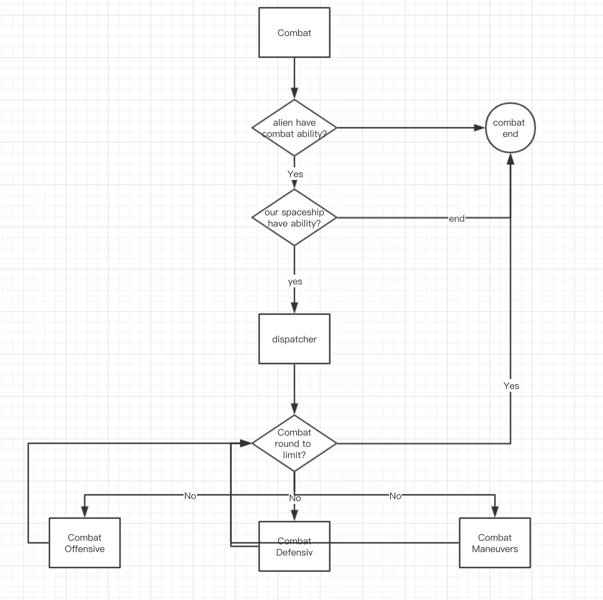

The code can be shown below just for example : 

~~~c++
void start(SpaceShip spaceShip){

        /* alien init */
        initAlien();
        /* judge alien's ability */
        if(!activityAbilityOK(alien, combat_defense_abilities)){
            
            GameLogger::stdOut("You are luckly, alien do not have weapon, you win in this combat");
            return;
        };
        
        
        
        limitRound = 3;
        while(keepFighting()){
            
            int _randSeed = GameTimer::_rand() % 3;
            
            
            
            switch (_randSeed) {
                case 0:
                    
                    GameLogger::stdOut("you are now combat maneuvers with alien");
                    
                    if(activityAbilityOK(spaceShip, combat_maneuvers_abilities)){
                            // start
                        combatManeuversActivity.start(alien);
                    }else{
                        
                        GameLogger::stdOut("sorry, you don't have ability to proceed");
                        
                    }
                    
                    break;
                case 1:
                    
                    GameLogger::stdOut("combat defensive !!!");

                    
                    if(activityAbilityOK(spaceShip, combat_defense_abilities)){
                        // start
                        combatDefensiveActivity.start(alien);
                    }else{
                        
                        GameLogger::stdOut("sorry, you don't have ability to proceed defensive");
                        
                    }
                    
                    break;
                case 2:
                    
                    GameLogger::stdOut("combat offensive !!!");
                    
                    if(activityAbilityOK(spaceShip, combat_offensive_abilities)){
                        
                    }else{
                        GameLogger::stdOut("sorry, you don't have ability to proceed offensive");

                    }
                    
                    break;
                default:
                    GameManager::gameError("combat parameter error !");
                    return;
            }
        }
        
    }
~~~

one of the screenshot while in combat : 

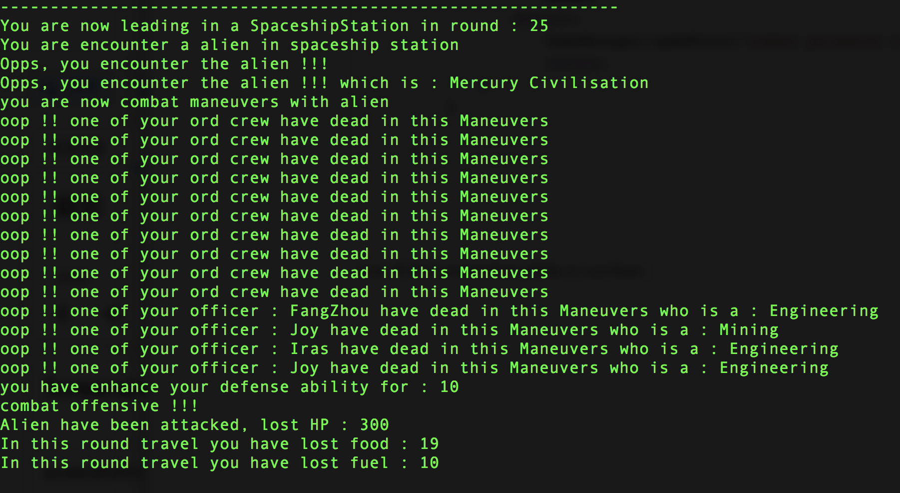

## 2. conflict

In the game, conflict Activity the spacecraft must be required to have the capability of **WEAPON, PILOT, ENGINEERING**

and this activity Involving three sub-events : 

- ConflictProceedActivty : have a small conflict with alien, and lost some resource
- ConflictEvasionActivity : luckly, you evasion from the conflict, and nothing lost

the interactions can be shown by the digram below :

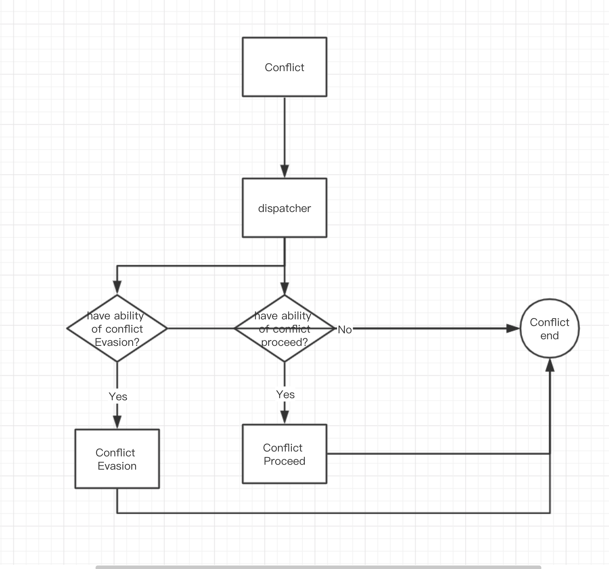

one of the screenshot while in conflict : 

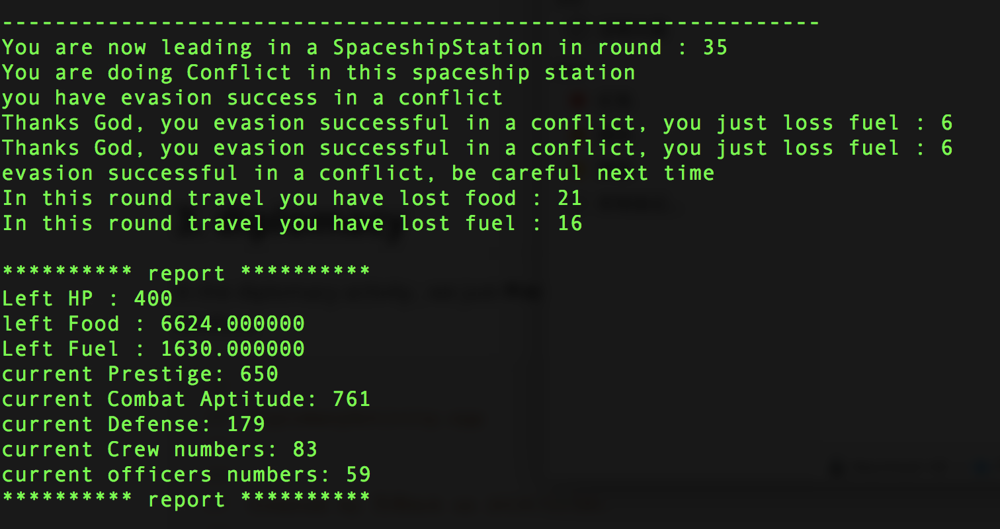

## 3. diplomacy

In the diplomacy activity , we just **Prestige** of our spaceship, which can Increase our probability of avoiding conflicts 

~~~C++
//
//  DiplomacyActivity.cpp
//  
//
//  Created by 方舟Ark on 2019/11/20.
//
#ifndef _DiplomacyActivity
#define _DiplomacyActivity

#include "Activity.cpp"
/*

 define the effect of happening diplomacy

 need ability:

    1. captain

 effect of this activity :

    1. improve the prestige which is helpful for avoiding the conflict

 */
class DiplomacyActivity : public Activity{

    private :

    /* the inc range for Prestige to increase */
    std::pair<int, int> PrestigeIncRange;

    public :

    // constructor
    DiplomacyActivity(){

        // PrestigeIncRange
        PrestigeIncRange = RuntimeParameter::DiPLOMACY_PRESTIGE_RANGE;

        // need captain to precess diplomacy
        NEED_ABILITES.push_back(Abilities::ABILITY_CAPTAIN);

    }

    /* main func */
    void start(SpaceShip &spaceShip){

        if(!diplomacyOK(spaceShip)) {

            // diplomacy error
            // for example : the captain dead
            GameLogger::stdOut("Diplomacy Fail!!!");
            return;
        }

        // inc thr prestige
        spaceShipDAO.incPrestige(getPrestigeIncNumber());
        GameLogger::stdOut("Diplomacy success, your Prestige becomce : " + std::to_string(spaceShip.getPrestige()));
        return;
    }

    // -------------------------------- helper function -------------------

    /*
        check if this ship can exc diplomacy
     */
    bool diplomacyOK(SpaceShip spaceShip){

        // condition1 || condition2 || ...
        return activityAbilityOK(spaceShip);
    }

    /* get a random inc for the Prestige*/
    int getPrestigeIncNumber(){

        int randomSeed = GameTimer::_rand() % (PrestigeIncRange.second - PrestigeIncRange.first);

        return PrestigeIncRange.first + randomSeed;

    }

};

#endif

~~~

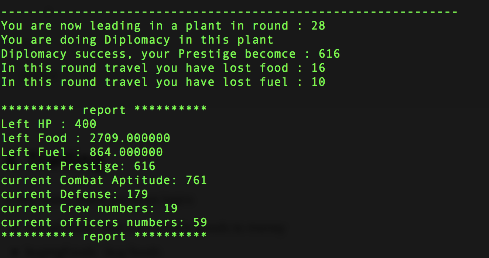s

## 4. Trading

In this event, there are three logics 

* salingGoods : sale our tratable goods to money

* buyingFoods : buy foods 

* buyingFuel : buy fuel 

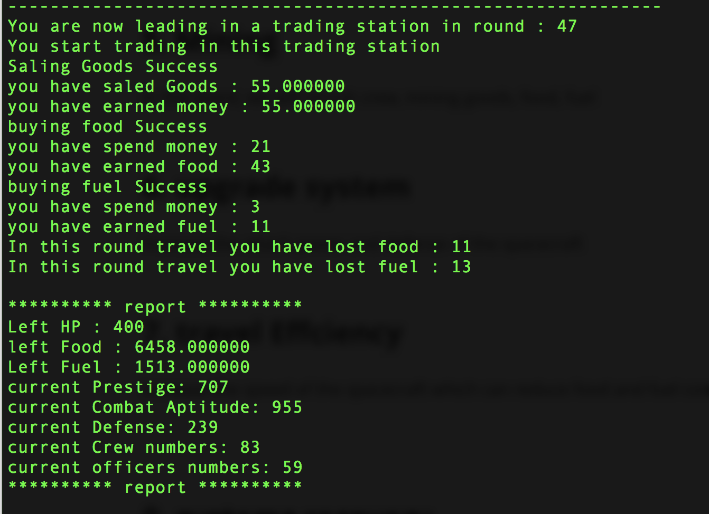

## 5. Mining

In this event, we will recruit crew, mining goods, food, fuel

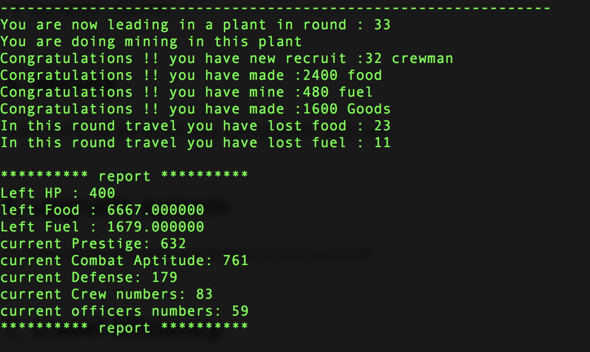

## 6. upgrade system

Increase the attack power and defense of the spacecraft

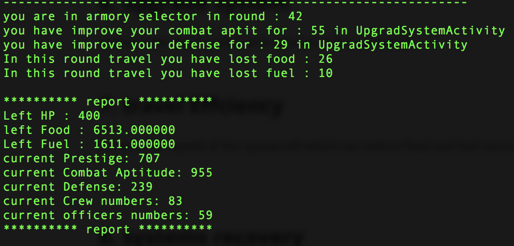

## 7. travel Effciency 

Increase the speed of the spacecraft which can reduce food and fuel consumption in the travel

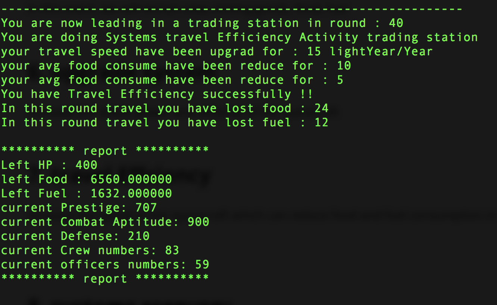

## 8. systems recovery

Increase the HP of the injured spaceship

**Supplement ordinary soldiers into officers**

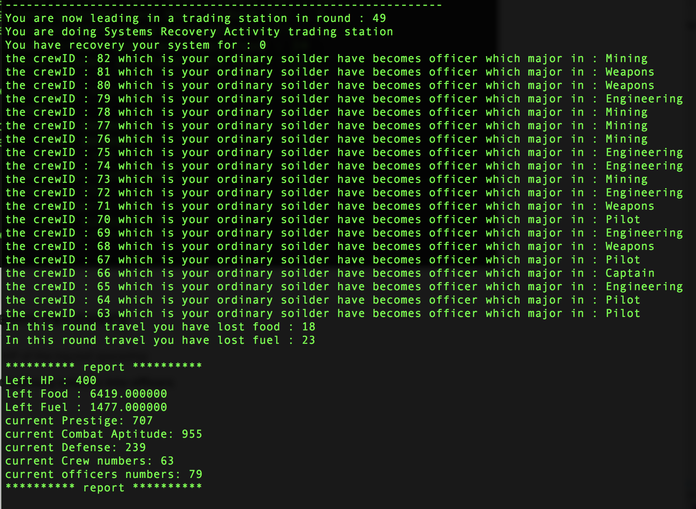

